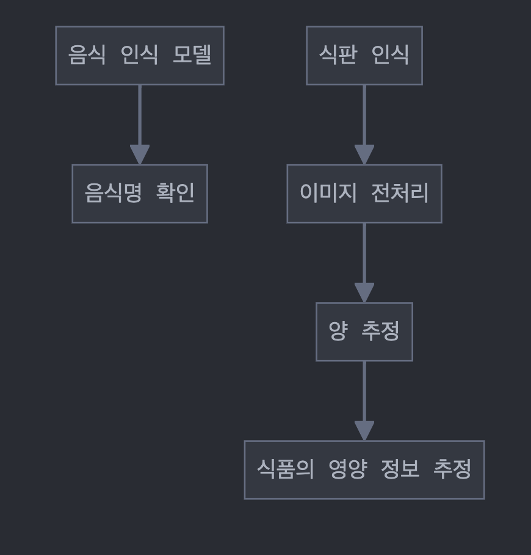

# food-ai-server

## 모델 사용 구조도

## 식판 인식 

- 식판 인식 모델 `bestplate.pt`
- 음식 인식 모델 `best.pt`

### 식판 이미지 전처리
- 입력 이미지의 x_center, y_cdenter, width, height 좌표 구하기
    - `detect_ai.predict(img_convert(img))`
        - bestplate.pt로 해당 식판의 xywh의 값을 구할 수 있다. 
        - 해당 값을 balcken_outside_bbox의 xywh 매개변수로 전달해야 한다.

- 바운딩 박스 바깥 이미지 검정색으로 채색
    - `blacken_outside_bbox(image_path, xywh, margin_ratio=0.08, output_path=None)`
        - 매개변수: (입력 이미지 경로), (입력 이미지의 x_center, y_center, width, height 좌표), (색칠할 마진 비율), (출력 경로)
        - 결과: output_path에 image_name+processed.jpeg 이미지 파일 생성
            - 후의 transformation을 위한 윤곽선을 잡을 때를 위해 보정한다. 
- 처리된 이미지 투영하여 transfromation
    - `edge_detection(img)`
        - 매개변수: (이미지 파일)
        - 결과: 이미지 파일에서 이전에 전처리하여 채색된 검정색 부분을 윤곽선으로 잡는다.
    - `contours(img, output_path)`
        - 매개변수: (이미지 파일), (출력 경로)
        - 결과: 윤곽선을 이미지의 끝 사각형에 맞추어 투영한 이미지 파일이 저장된다.

